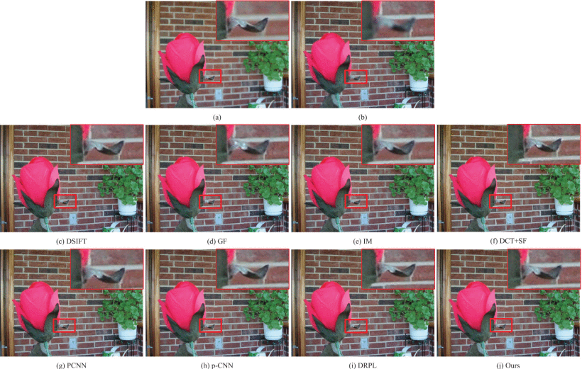
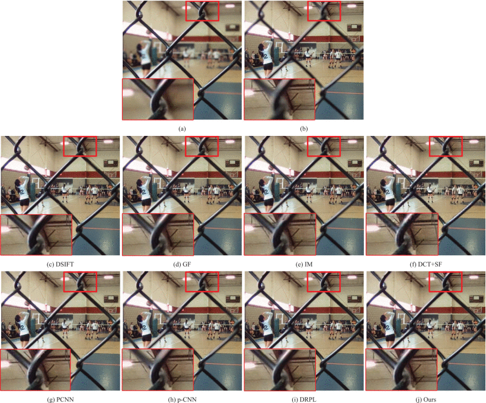
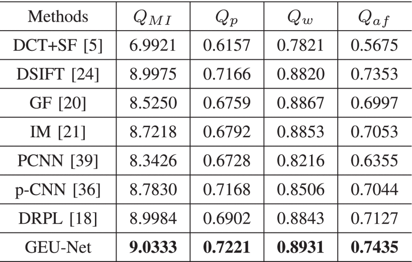
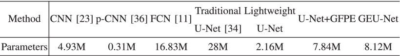

GEU-Net
========
This repository contains the reference implementation for our proposed [GEU-Net][1] in PyTorch. The two main entry-points are [train.py](train.py) and [inferences.py](inferences.py). train.py performs model training while inferences.py performs GEU-Net inference on test dataset.

Requirements
-------------

**Plattform**: *Linux (or windows), python3 >= 3.6, pytorch >= 1.4.0, cuda, cudnn*

**Python Packages**: *scipy, torchvision, numpy, torch, scikit_image, matplotlib, opencv_python_headless, mmcv, pandas, Pillow, pydensecrf, skimage*

To install those python packages run `pip install -r requirements.txt` or `pip install scipy, torchvision, numpy, torch, scikit_image, matplotlib, opencv_python_headless, mmcv, pandas, Pillow, pydensecrf, skimage`.  I recommand using a [python virtualenv][2].

Execute
--------
Tips: The training dataset needs to be exported to a csv file by running [make_dataset.py](utils/make_dataset.py) first, and then changing the parser parameters in the [utils.py](utils/utils.py) file according to the path of the training dataset csv file and the path of the validation and test dataset.

**train**: Run `python train.py` to perform model training. Training parameters can be changed in the [utils.py](utils/utils.py).

**inferences**: Run `python inferences.py` to performs GEU-Net inference on test dataset. Inferences parameters can be changed in the [utils.py](utils/utils.py).

Fused results
--------

Citation
--------
If you benefit from this project, please consider citing our [paper][1].
> B. Xiao, B. Xu, X. Bi and W. Li, "Global-Feature Encoding U-Net (GEU-Net) for Multi-Focus Image Fusion," in IEEE Transactions on Image Processing, vol. 30, pp. 163-175, 2021, doi: 10.1109/TIP.2020.3033158.

[1]: https://ieeexplore.ieee.org/abstract/document/9242278
[2]: https://virtualenvwrapper.readthedocs.io/en/latest/
